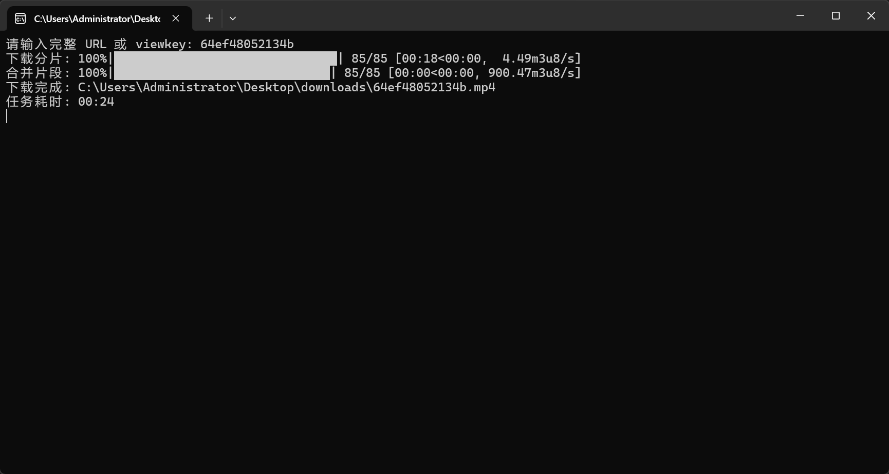
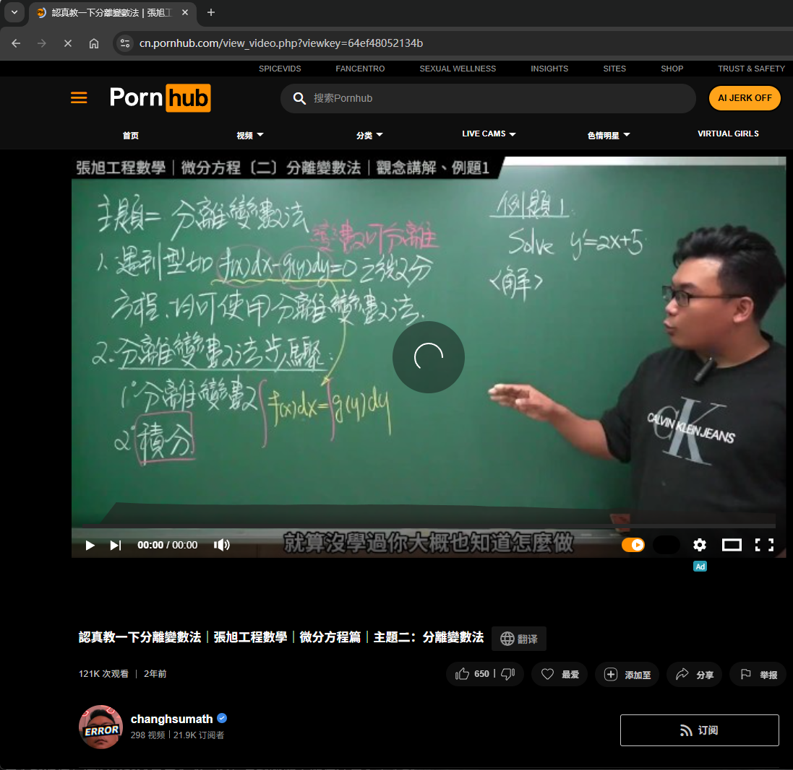

# PH-Downloader

## 免责声明

这款轻量级流媒体下载器旨在作为流媒体技术研究与个人使用场景的工具。请严格遵守您所在司法辖区的法律法规与访问目标网站的服务条款。严禁用于任何违法行为，包括但不限于版权侵犯、未授权内容分发等。用户需对自身使用行为承担全部责任，开发者不对任何滥用行为负责。

------

## 项目简介

PH-Downloader 是一个基于 Python3 的轻量级流媒体下载器，用于：

- 学习 m3u8 分片机制
- 了解 TS 片段的多线程下载调度
- 掌握 FFmpeg 分段合并与容器格式转换
- 理解 CDN 资源访问与流式 I/O 操作

该项目涵盖从页面解析、m3u8 处理、分片调度、并发下载、合并转换，到最终归档的一整套全流程实现。

------

## 功能特性

| 功能                 | 描述                                                     |
| -------------------- | -------------------------------------------------------- |
| **自动解析视频流**   | 解析页面 HTML 中的 `mediaDefinitions` 并自动选择最高画质 |
| **m3u8 解析**        | 自动识别主 m3u8、variant m3u8 与最终 TS 列表             |
| **多线程下载**       | 使用 `ThreadPoolExecutor` + `tqdm` 显示统一进度条        |
| **自动合并 ts 文件** | 基于数字序排序，边读边写显示合并进度                     |
| **FFmpeg 自动转换**  | 调用内置 `ffmpeg/bin/ffmpeg.exe`，无需安装 FFmpeg        |
| **最终文件归档**     | 所有完成的 MP4 自动移动到 `/downloads/`                  |
| **CLI 友好交互**     | 输入 URL 或 viewkey 即可下载文件                         |

------

## 使用方法

### 1. 安装依赖

```
pip install -r requirements.txt
```

### 2. 运行脚本

```
python main.py
```

脚本会要求输入：

```
请输入完整 URL 或 viewkey:
```

示例：

```
viewkey=64ef48052134b
https://cn.pornhub.com/view_video.php?viewkey=64ef48052134b
```

### 3. 输出结果

最终的 `.mp4` 会自动归档到：

```
./downloads
```

------

## 运行效果





------

## 推荐工具

### PotPlayer

PotPlayer 是由韩国 Kakao 公司开发的一款多媒体播放器，凭借 轻量、解码快、无广告 的特性，成为很多用户的首选。无论是高清视频、蓝光文件，还是外挂字幕，它都能轻松搞定。

[下载安装教程](https://zhuanlan.zhihu.com/p/1949416646390290022)

------

### VPN

**推荐使用大航海VPN**

**为了保证脚本可正常访问外网，请务必使用优质 VPN。**

[注册跳转链接](https://dhh.app/#/register?code=MvcnHnHK)